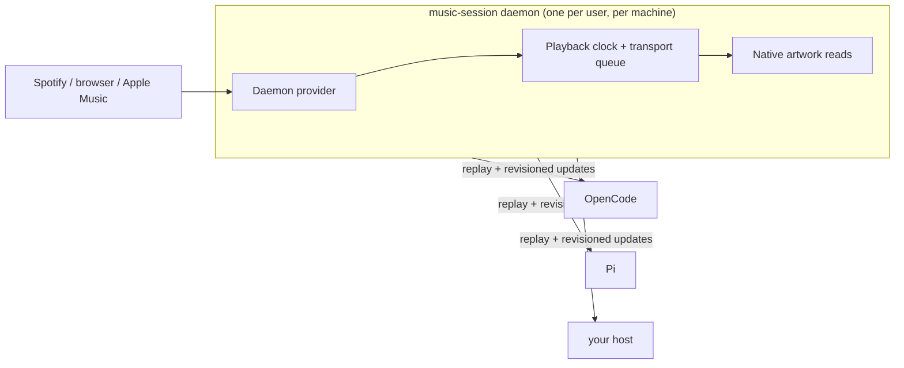

# `@naxodev/music-core`

<p align="center">
  
</p>

[](https://www.npmjs.com/package/@naxodev/music-core)
[](LICENSE)

Host-neutral music-session contracts, a same-user machine-local client boundary, and compatibility APIs for Pi and OpenCode. One daemon owns the media provider; every host connects to the same playback truth.

```ts
import {
  createReconnectingMusicSessionClient,
  baselineCapabilities,
} from "@naxodev/music-core"

const client = await createReconnectingMusicSessionClient({
  clientId: "my-host-session",
  hostKind: "test",
  capabilities: [...baselineCapabilities],
})

const stopState = client.subscribeState((snapshot) => render(snapshot.state))
const stopStatus = client.subscribeStatus((status) => renderStatus(status))

await client.play()
stopState()
stopStatus()
await client.dispose()
```

## Architecture



Many host clients connect to one owner-only Unix socket daemon. The daemon selects and owns one provider, its event source, playback clock, recovery polling, state and status authority, global transport queue, and native artwork reads. Clients receive hello, status, and state replay on connection, followed by revisioned updates. Host presentation stays outside this package.

The implementation uses Effect v4 ownership rather than host timers and provider processes: `Config` validates runtime limits and timing, `Schema` validates untrusted protocol and provider data, and Layers/scopes own the provider, coordinator, listener, connections, and finalizers. `Schedule` paces startup and reconnect, `SubscriptionRef` provides replayable status and state, and bounded queues, semaphores, and streams isolate command, sampling, fan-out, and artwork work.

Read the [music session architecture field guide](https://github.com/naxodev/ai/blob/main/docs/music-session-architecture.html) for the complete ownership and failure model.

## Build on it

Use a unique client ID and a valid host kind. Subscribe before rendering so replayed state and status can establish presentation, use the transport methods for commands, and await `dispose()` when the host lifecycle ends.

```ts
import { createEngine, stepEngine, displayLevel } from "@naxodev/music-core"

const engine = createEngine(16, trackKey)
stepEngine(engine, {
  track_key: trackKey,
  bars: 16,
  progress_ms: state.progress_ms,
  fetched_at: state.fetched_at,
  is_playing: state.is_playing,
  duration_ms: state.track.duration_ms,
  now_ms: Date.now(),
})
// Per-bar 0..1 levels for your own waveform renderer.
const levels = Array.from(engine.levels, (level, index) =>
  displayLevel(level, index, state.is_playing),
)
```

## Public surface

```ts
import {
  type Track,
  type Device,
  type PlayerState,
  type MusicError,
  type MusicBackend,
  type MusicChangeDisposer,
  type MusicChangeListener,
  type MusicChangeEvent,
  type MusicChangeSnapshotEvent,
  type MusicChangeInvalidationEvent,
  emptyPlayer,
  isMac,
  formatMs,
  type Clock,
  type PlaybackClock,
  type SampleSyncInput,
  type SampleSyncResult,
  createPlaybackClock,
  liveFromClock,
  resetClock,
  seekClock,
  setClockPlaying,
  syncFromSample,
  trackKey,
  mergePlayer,
  sameTrackIdentity,
  type WaveEngine,
  type WaveFrame,
  createEngine,
  displayLevel,
  isFlat,
  livePlaybackPosition,
  stepEngine,
  waveformSeedKey,
  type CommandResult,
  type LineStreamCallbacks,
  type LineStreamDisposer,
  type LineStreamStarter,
  run,
  startLineStream,
  whichOk,
  type SystemMediaDependencies,
  createSystemMedia,
  bundleLabel,
  effectiveBundle,
  hasMediaControl,
  hasNowPlayingCli,
  resetMediaBackend,
  type MusicSessionClient,
  type MusicSessionClientOptions,
  type MusicSessionConnectionLifecycle,
  type ReconnectingMusicSessionClient,
  type ReconnectingMusicSessionClientOptions,
  createMusicSessionClient,
  createReconnectingMusicSessionClient,
  MusicSessionClientError,
  type ArtworkIdentity,
  type ArtworkResult,
  type Capability,
  type HostKind,
  type ProtocolError,
  type ProtocolErrorCode,
  type ProviderStatus,
  type RevisionedState,
  type TransportAction,
  PROTOCOL,
  baselineCapabilities,
} from "@naxodev/music-core"
```

The package also exports the track, device, player, formatting, clock, reconciliation, waveform, runner, and system-media compatibility symbols from `index.ts`. `createSystemMedia()` remains an intentional low-level provider API for compatibility and custom integrations. Production Pi and OpenCode hosts use the session client instead.

## Requirements

- Node.js 22.19 or later, or Bun 1.3 or later
- macOS for system media discovery and transport
- A TypeScript-aware runtime or bundler because the package publishes TypeScript source

```sh
bun add @naxodev/music-core
```

The formatting, clock, reconciliation, waveform, and protocol APIs are platform-neutral. `createSystemMedia()` and the managed music-session daemon require macOS media providers.

## Lifecycle and compatibility

Concurrent callers that find no endpoint converge through owner-only startup-marker coordination; socket binding remains the final singleton authority. Hello negotiates a supported revision and capability intersection, so supported legacy and current package versions can share a live daemon. An incompatible client receives terminal range details and cannot unlink, replace, or otherwise disturb the healthy generation.

A reconnecting client retains its last accepted state for presentation. It adopts a replacement only after hello and replay succeed, fences old daemon instance IDs and revisions, and never replays commands. Commands unresolved at connection loss are indeterminate. When the last negotiated client leaves, the daemon starts a bounded idle grace; final cleanup removes only artifacts whose ownership it has proven.

## Bounds and cost

Frames, queues, and pending requests are finite. A slow or abusive connection can be disconnected locally without blocking other clients; state fan-out coalesces while required responses and status remain preserved. Provider observation is O(1), client fan-out is O(N), and the native-artwork path is bounded and deduplicated. The verified 24-client alternating scenario is capacity evidence, not a configured maximum.

## Low-level provider compatibility

`createSystemMedia()` exposes normalized media discovery and transport for low-level consumers. It supports provider event subscriptions when available and polling-only fallback behavior, but it does not describe the production host topology. Use the session client for shared daemon ownership.

## Community

Use [GitHub Discussions](https://github.com/naxodev/ai/discussions) for usage questions and [GitHub Issues](https://github.com/naxodev/ai/issues) for reproducible defects. Report vulnerabilities through the workspace [security policy](https://github.com/naxodev/ai/blob/main/SECURITY.md).

## License

[MIT](LICENSE)
